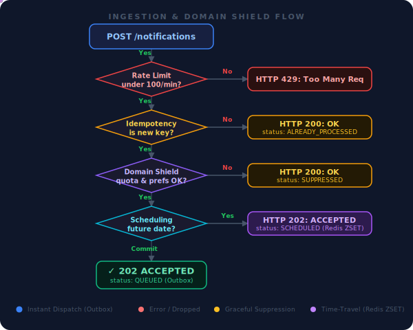

# Use Cases — Notification Gateway

This document outlines industry scenarios that map to the architectural capabilities of this notification service, demonstrating how the **Domain Shield**, **Scheduler**, and **Idempotency** layers operate in production.

---

## 1. Digital Banking & Fintech

**Key Requirement:** Absolute zero data loss and strict prevention of duplicate alerts (Thundering Herd mitigation).

| Event | Channel | Template | System Behavior |
| --- | --- | --- | --- |
| OTP / 2FA Request | SMS | `security_alert` | Immediate dispatch. Bypasses DND settings but enforces strict rate limits. |
| Debit Notification | Push | `transactional` | **Two-Tier Idempotency** ensures that even if the billing service double-fires the request, the user only receives one alert. |
| Monthly Statement | Email | `transactional` | Handled via Outbox pattern; guaranteed delivery even if SendGrid experiences downtime. |
| Credit Card Offer | Email | `marketing_promo` | Blocked if user has opted out of promotional messages in their preferences. |

---

## 2. E-Commerce & Logistics

**Key Requirement:** High throughput ingestion and complex time-travel scheduling.

| Event | Channel | Template | System Behavior |
| --- | --- | --- | --- |
| Order Placed | Email | `transactional` | Immediate ingestion. |
| Delivery Tomorrow | SMS | `transactional` | Uses **Time-Travel Scheduling**. Ingested today but held in the Redis ZSET until 08:00 AM local time tomorrow. |
| Weekend Flash Sale | Push | `marketing_promo` | Intercepted by the **Domain Quota Shield**. If the user has already received 3 promos this week, it is gracefully suppressed (returns HTTP 200 to prevent retries). |
| Cart Abandonment | Email | `marketing_promo` | Scheduled 4 hours in the future. Can be dynamically canceled if the user completes the checkout. |

---

## 3. SaaS & EdTech

**Key Requirement:** Recurring reminders and complex user-defined Do-Not-Disturb (DND) windows.

| Event | Channel | Template | System Behavior |
| --- | --- | --- | --- |
| Password Reset | Email | `security_alert` | Immediate dispatch. |
| Daily Class Reminder | Push | `daily_reminder` | Uses the **"Spawn-on-Fire"** rolling recurrence pattern. Parses a cron string (`0 9 * * 1-5`), fires the current event, and automatically clones a new row in PostgreSQL for the next day. |
| Weekly Digest | Email | `marketing_promo` | **Late-Bound Preference Check**. Evaluates the user's opt-out status at the exact millisecond of dispatch, not at the time of scheduling. |
| Late-night message | SMS | `transactional` | Intercepted by the **Do-Not-Disturb (DND)** engine and held in the scheduler until the user's DND window expires the next morning. |

---

## Channel × Template Decision Matrix

Use this matrix to determine the optimal routing parameters when integrating upstream microservices with the `POST /api/v1/notifications/` endpoint.

|  | `security_alert` | `transactional` | `marketing_promo` | `daily_reminder` |
| --- | --- | --- | --- | --- |
| **email** | Password Resets, Account Lockouts | Receipts, Order Confirmations | Newsletters, Flash Sales | Weekly App Digests |
| **sms** | OTPs, Fraud Alerts | Delivery Updates | *Use Sparingly* (High cost) | Medication Reminders |
| **push** | Suspicious Login | Ride Matched, Payment Sent | New Feature Drop | Standup/Habit Prompts |

---

## Ingestion Domain Shield

To prevent upstream microservices from having to understand user preferences, quotas, or rate limits, this gateway operates a strict **Domain Shield**.

**"Fail Open / Graceful Suppression" Protocol:**
If a notification is blocked by the Idempotency Lock, Quota limits, or User Opt-Outs, the API **does not** return an HTTP 400 or 500. Instead, it returns an **HTTP 200 OK** with a status of `SUPPRESSED` or `ALREADY_PROCESSED`.

This guarantees that upstream services (like a payment processor) can safely cross the notification off their internal to-do list without continuously retrying and accidentally creating a DDoS attack on the notification gateway.
