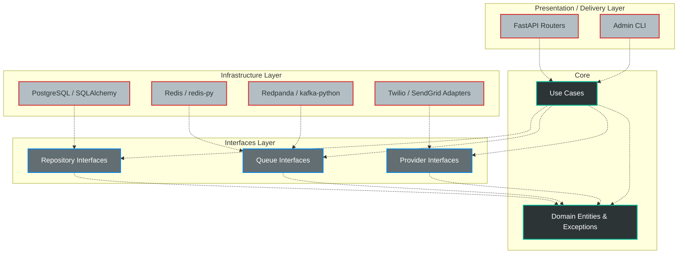
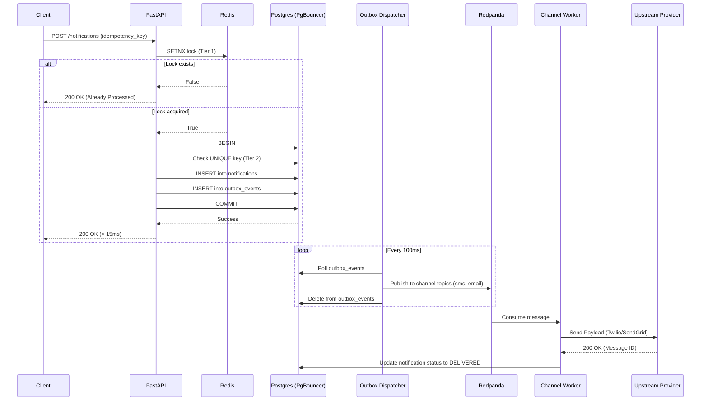

# System Design

## 📖 Overview

This document serves as the architectural compass for the platform. It outlines the core design decisions, infrastructure topologies, and data flows that allow this notification system to scale to 1 million+ active users and handle thousands of requests per second (RPS) without degraded performance.

The primary engineering philosophy of this system is **Asynchronous Resilience**. I assumed that databases will lock, networks will drop, and third-party APIs will fail. The architecture is designed to absorb these failures via decoupling, backpressure, and self-healing infrastructure.

---

## 🏛️ 1. Architectural Boundaries (Clean Architecture)

To maintain long-term agility, this codebase strictly adheres to **Clean Architecture (Ports and Adapters)**.

Dependencies point *inward*. The core business logic never imports libraries related to HTTP, SQL, or Kafka. This allows us to swap a database or a message broker without rewriting a single line of domain logic.

---

## 🔄 2. The Lifecycle of a Notification

When a user triggers an event (e.g., a password reset), the system guarantees delivery without blocking the user's HTTP request.

Here is the lifecycle of a notification:

---

## 🧠 3. Design Patterns Justifications

### Transactional Outbox Pattern vs. Synchronous APIs

* **Alternative:** The API calls Twilio directly. If Twilio takes 3 seconds to respond, the API connection stays open for 3 seconds. At 500 RPS, we exhaust all server threads instantly, causing a complete system outage.
* **Decision:** The Outbox Pattern decouples ingestion from delivery. The API writes to the database and hangs up. Redpanda buffers the delivery. If Twilio goes down, messages safely queue up in Kafka until the outage is resolved. **Trade-off:** We sacrifice immediate delivery confirmation to the client in exchange for API ingestion scalability.

### Distributed Locks (Two-Tier Idempotency) vs. Database-Only Checks

* **Alternative:** Relying purely on Postgres `UNIQUE` constraints for idempotency.
* **Decision:** A Redis `SETNX` lock sits in front of the database. When mobile clients aggressively retry requests due to poor network conditions ("Thundering Herd"), Redis deflects the duplicate payloads in RAM. **Trade-off:** Requires maintaining a Redis cluster, but prevents heavy connection and CPU burn on the relational database during traffic spikes.

### Dependency Inversion

* **Alternative:** Hardcoding `psycopg2` and `boto3` queries directly into the API routes.
* **Decision:** By using Repository and Provider interfaces, we isolate side effects. **Trade-off:** Introduces boilerplate (Interfaces, DTOs, Use Cases). However, it allows us to run isolated unit tests using Mock Repositories without spinning up Docker containers.

---

## 🏗️ 4. Future Architecture Improvements

While the foundational architecture handles massive scale, the following mechanisms, if implemented can achieve better observability and long-term storage sustainability.

### 4.1. Distributed Tracing (OpenTelemetry)

* **Current State:** Requests generate a `correlation_id` tracked via JSON logs.
* **Problem:** Stitching together logs across API, Dispatcher, and Worker containers during a dropped-message investigation is manual.
* **Solution:** Inject OpenTelemetry (OTel). The API will generate a Trace ID, propagate it into the Postgres Outbox JSON, push it into the Redpanda headers, and extract it in the worker. This allows tools like Jaeger or Grafana Tempo to visualize the exact microsecond latency of every hop in a single waterfall graph.

### 4.2. Database Table Partitioning

* **Current State:** All events live in a single `notifications` table.
* **Problem:** At 150 RPS, the system generates ~12 million rows a day. Within months, B-Tree indexes will exceed RAM capacity, severely degrading query performance.
* **Solution:** Implement Postgres Native Partitioning. The `notifications` table will be partitioned by `created_at` (e.g., monthly). Old partitions can be archived to AWS S3 and dropped from the live database in milliseconds, ensuring the active working set always remains lean and fast.

### 4.3. The DLQ Replay Mechanism

* **Current State:** Poison-pill messages (e.g., exceeding 5 Twilio API failures) are safely routed to a Redpanda Dead Letter Queue (`dlq.notifications`) to prevent queue blockage.
* **Problem:** Messages in the DLQ are currently stagnant.
* **Solution:** Build a secured Replay Utility (Admin API endpoint or CLI tool) that can bulk-read the DLQ, reset retry counters, and inject the payloads back into the primary channel topics once upstream provider stability is confirmed.
