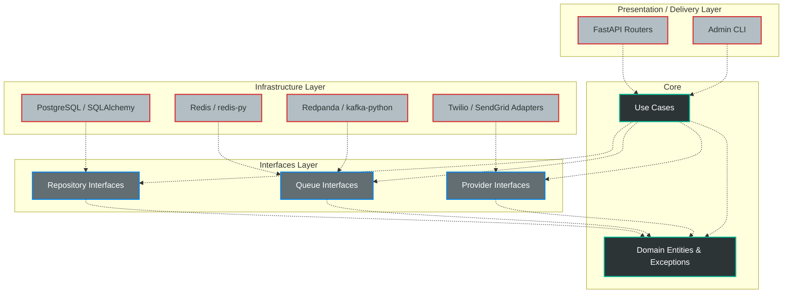
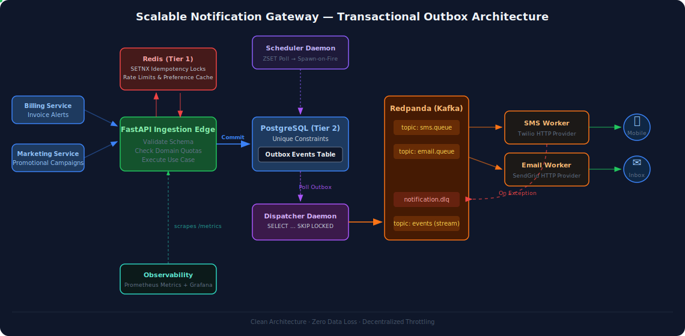

# System Design

## 📖 Overview

This document serves as the architectural compass for the platform. It outlines the core design decisions, infrastructure topologies, and data flows that allow this notification system to scale to 1 million+ active users and handle thousands of requests per second (RPS) without degraded performance.

The primary engineering philosophy of this system is **Asynchronous Resilience**. I assumed that databases will lock, networks will drop, and third-party APIs will fail. The architecture is designed to absorb these failures via decoupling, backpressure, and self-healing infrastructure.

---

## 🏛️ 1. Architectural Boundaries (Clean Architecture)

To maintain long-term agility, this codebase strictly adheres to **Clean Architecture (Ports and Adapters)**.

Dependencies point *inward*. The core business logic never imports libraries related to HTTP, SQL, or Kafka. This allows us to swap a database or a message broker without rewriting a single line of domain logic.

---

## 🔄 2. The Lifecycle of a Notification

When a user triggers an event (e.g., a password reset), the system guarantees delivery without blocking the user's HTTP request.

Here is the lifecycle of a notification:

---

## 🧠 3. Design Patterns Justifications

### Transactional Outbox Pattern vs. Synchronous APIs

* **Alternative:** The API calls Twilio directly. If Twilio takes 3 seconds to respond, the API connection stays open for 3 seconds. At 500 RPS, we exhaust all server threads instantly, causing a complete system outage.
* **Decision:** The Outbox Pattern decouples ingestion from delivery. The API writes to the database and hangs up. Redpanda buffers the delivery. If Twilio goes down, messages safely queue up in Kafka until the outage is resolved. **Trade-off:** We sacrifice immediate delivery confirmation to the client in exchange for API ingestion scalability.

### Distributed Locks (Two-Tier Idempotency) vs. Database-Only Checks

* **Alternative:** Relying purely on Postgres `UNIQUE` constraints for idempotency.
* **Decision:** A Redis `SETNX` lock sits in front of the database. When mobile clients aggressively retry requests due to poor network conditions ("Thundering Herd"), Redis deflects the duplicate payloads in RAM. **Trade-off:** Requires maintaining a Redis cluster, but prevents heavy connection and CPU burn on the relational database during traffic spikes.

### Dependency Inversion

* **Alternative:** Hardcoding `psycopg2` and `boto3` queries directly into the API routes.
* **Decision:** By using Repository and Provider interfaces, we isolate side effects. **Trade-off:** Introduces boilerplate (Interfaces, DTOs, Use Cases). However, it allows us to run isolated unit tests using Mock Repositories without spinning up Docker containers.

### Late-Bound Check (Time-Travel Protection)

* **Problem:** Scheduled notifications represent a *future intent*. If an API checks user preferences at the time of ingestion (e.g., Monday) for a message scheduled for Friday, the system risks violating user consent if the user opts out on Wednesday.
* **Decision:** The Scheduler Worker performs a "Late-Bound Check". Right before the worker moves a message from the Redis delayed queue into the Postgres Outbox for delivery, it queries the Preference Provider again. If the user opted out in the interim, the worker drops the payload and marks the database record as `SUPPRESSED`. **Trade-off:** Adds a microsecond read operation to the worker loop, but mathematically guarantees compliance with user consent.

---

## 🚀 Future Enhancements & Production Hardening

While this architecture guarantees zero data loss and prevents thundering herds, pushing it to a true 99.99% SLA at 50M+ daily notifications requires graduating from a single-node Docker topology to a distributed cloud environment. 

If this system were to be promoted to a Tier-1 production environment, the following architectural upgrades would need to be implemented:

### 1. High Availability (HA) Infrastructure Topology
Currently, components like PgBouncer and PostgreSQL are running as single instances. 
* **Database HA:** Implement PostgreSQL streaming replication with an auto-failover manager (e.g., Patroni).
* **Redis HA:** Upgrade the single Redis instance to a Redis Cluster or Redis Sentinel deployment to ensure the distributed locks and rate limiters survive hardware failures.
* **API Fleet:** Deploy the FastAPI application behind an AWS ALB or Kubernetes Ingress to horizontally scale ingestion across multiple availability zones.

### 2. Dispatcher Horizontal Scaling (`SKIP LOCKED`)
A single `dispatcher_daemon` reading from the Postgres Outbox table creates a bottleneck at 2,000+ RPS. 
* **Solution:** Implement PostgreSQL's `SELECT ... FOR UPDATE SKIP LOCKED` query in the dispatcher. This allows multiple dispatcher worker containers to query the outbox table concurrently without locking collisions, allowing the Outbox-to-Kafka relay to scale horizontally.

### 3. Distributed Tracing (OpenTelemetry)
While JSON logs with `correlation_id` injection are present, tracing an asynchronous message through the API → Postgres Outbox → Dispatcher → Kafka → Worker is complex.
* **Solution:** Implement the OpenTelemetry (OTel) SDK. Generate a Trace ID at the FastAPI middleware layer, inject it into the Postgres JSON payload, map it to the Redpanda message headers, and export the spans to Jaeger or Grafana Tempo for visual waterfall debugging.

### 4. Partition Keying for Strict Ordering
Currently, messages are routed to Redpanda partitions round-robin or randomly. 
* **Solution:** Map the `user_id` as the Kafka Message Key. This guarantees that multiple notifications meant for the same user (e.g., `Order Created` followed by `Order Shipped`) will always land on the exact same partition, guaranteeing strict chronological processing by the workers.

### 5. DLQ Replay Utility
Chaos testing proves that isolated failures (e.g., Twilio 503s) safely route messages to the Dead Letter Queue (`notification.dlq`). However, those messages currently remain parked.
* **Solution:** Build a secured administrative CLI or API endpoint that consumes from the DLQ and re-publishes the payloads back into the primary topics once the downstream provider's outage is resolved.

### 6. Database Table Partitioning
At 2,000 requests per second, the PostgreSQL `notifications` table will generate ~50 million rows per month, eventually degrading B-Tree index performance.
* **Solution:** Implement PostgreSQL Native Table Partitioning by `created_at` (e.g., monthly partitions). This allows rapid querying of active notifications and enables the operations team to archive or drop 6-month-old partitions in milliseconds (Cold Storage).

### 7. API Gateway & Authentication
The current ingestion endpoints are unprotected to simplify local load testing.
* **Solution:** Place the service behind an API Gateway (e.g., Kong, AWS API Gateway) and implement OAuth2 or JWT-based authentication. The gateway would handle token validation and tenant identification before traffic reaches the Python layer.
